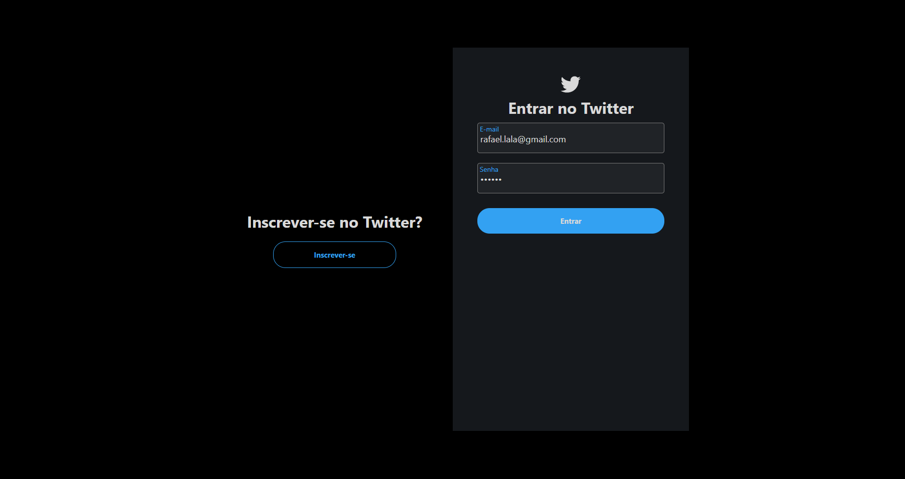
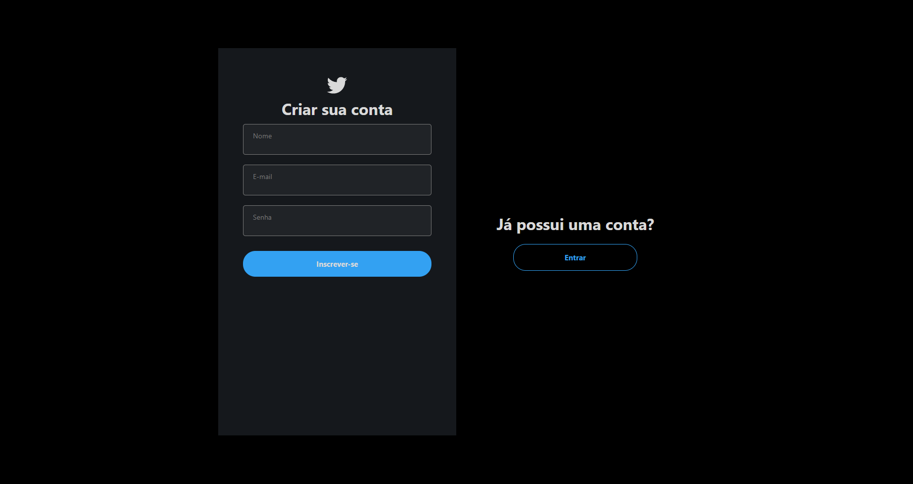
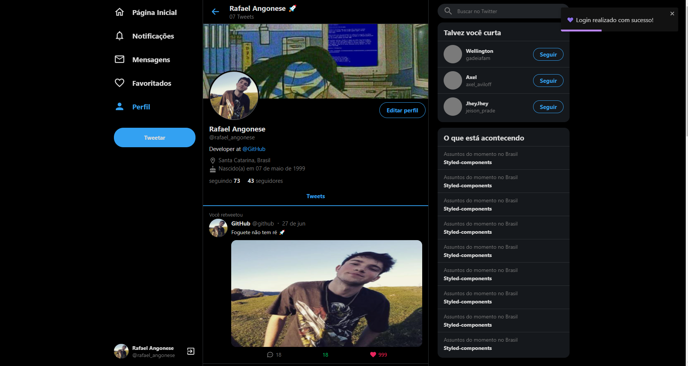

<p align="center">
  
</p>

<p  align="center">
    
    
</p>

<p align="center">
    
</p>

## ✨ Tecnologias

Esse projeto foi desenvolvido com as seguintes tecnologias:

-   [Nextjs](https://nextjs.org/)
-   [TypeScript](https://www.typescriptlang.org/)
-   [Styled-components](https://styled-components.com/)
-   [Graphql](https://graphql.org/)
-   [Apollo Graphql](https://www.apollographql.com/)
-   ... e outros

## 💻 Projeto

A estrutura inicial foi feita com base no projeto da Rocketseat [UI Clone - Twitter Responsive](https://github.com/rocketseat-content/youtube-clone-twitter) feito pelo [Guilherme Rodz](https://github.com/guilhermerodz)

Este projeto é um clone simplificado do Twitter, ele tem como objetivo aplicar algumas tecnologias de forma prática.

## Ambiente de desenvolvimento

```bash
node --version
v16.0.0

yarn --version
1.22.4
```

## 🚀 Como executar

-   Clone o repositório
-   Instale as dependências com `yarn`
-   Inicie o servidor com `yarn dev`
-   A aplicação pode ser acessada em [`localhost:3333`](http://localhost:3333).

-   Execute o Back-end que está [aqui](https://github.com/rafael-angonese/twitter-clone-api-nest-graphql)

## 📄 Licença

Esse projeto está sob a licença MIT. Veja o arquivo [LICENSE](LICENSE.md) para mais detalhes.

---

Feito com ♥ by Rafael Angonese
